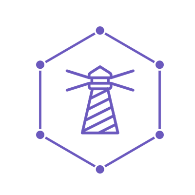

  

# Lighthouse

**A framework for serving GraphQL from Laravel**

Lighthouse is a GraphQL framework that integrates with your Laravel application.
It takes the best ideas of both and combines them to solve common tasks with ease
and offer flexibility when you need it.

## Documentation

The documentation lives at [lighthouse-php.com](https://lighthouse-php.com/).

A chinese translation is available at [lighthouse-php.cn](http://lighthouse-php.cn/) and is maintained
over at https://github.com/haxibiao/lighthouse.

## Get involved

- Have a question? [Use the laravel-lighthouse tag on Stack Overflow](https://stackoverflow.com/questions/tagged/laravel-lighthouse)
- Talk to other users? [Hop into Slack](https://join.slack.com/t/lighthouse-php/shared_invite/enQtMzc1NzQwNTUxMjk3LWMyZWRiNWFmZGUxZmRlNDJkMTQ2ZDA1NzQ1YjVkNTdmNWE1OTUyZjZiN2I2ZGQxNTNiZTZiY2JlNmY2MGUyNTQ)
- Found a bug? [Report a bug](https://github.com/nuwave/lighthouse/issues/new?template=bug_report.md)
- Have an idea? [Propose a feature](https://github.com/nuwave/lighthouse/issues/new?template=feature_proposal.md)
- Want to improve Lighthouse? [Read our contribution guidelines](https://github.com/nuwave/lighthouse/blob/master/CONTRIBUTING.md)

## Changelog

All notable changes to this project are documented in [`CHANGELOG.md`](CHANGELOG.md).

## Upgrade Guide

When upgrading between major versions of Lighthouse, consider [`UPGRADE.MD`](UPGRADE.md).

## Contributing

We welcome contributions of any kind, see how in [`CONTRIBUTING.md`](CONTRIBUTING.md).

## Security Vulnerabilities

If you discover a security vulnerability within Lighthouse,
please email Benedikt Franke via [benedikt@franke.tech](mailto:benedikt@franke.tech)
or visit https://tidelift.com/security.
