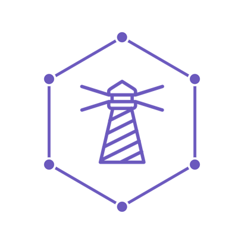

**This repository is planned to move to [spawnia/lighthouse](https://github.com/spawnia/lighthouse).**
**See the [announcement](https://github.com/nuwave/lighthouse/discussions/2767) for details and to share feedback.**

# Lighthouse

A framework for serving GraphQL from Laravel.

Lighthouse is a GraphQL framework that integrates with your Laravel application.
It combines the best ideas of both ecosystems.
It solves common tasks with ease and offers flexibility when you need it.

## Sponsors

If you make money using this project, please consider sponsoring [its maintainer on GitHub Sponsors](https://github.com/sponsors/spawnia) or [the project on Patreon](https://www.patreon.com/lighthouse_php).

## Documentation

The documentation lives at [lighthouse-php.com](https://lighthouse-php.com).

The site includes the latest docs for each major version of Lighthouse.
You can find docs for specific versions by looking at the contents of [/docs/master](/docs/master) at that point in the git history: `https://github.com/nuwave/lighthouse/tree/<SPECIFIC-TAG>/docs/master`.

## Get Involved

- Have a question? [Get your answer using GitHub discussions](https://github.com/nuwave/lighthouse/discussions/new?category=q-a)
- Talk to other users? [Start a discussion](https://github.com/nuwave/lighthouse/discussions/new?category=general)
- Found a bug? [Report a bug](https://github.com/nuwave/lighthouse/issues/new?template=bug_report.md)
- Have an idea? [Propose a feature](https://github.com/nuwave/lighthouse/issues/new?template=feature_proposal.md)
- Want to improve Lighthouse? [Read our contribution guidelines](https://github.com/nuwave/lighthouse/blob/master/CONTRIBUTING.md)

## Versioning

Lighthouse follows [Semantic Versioning](https://semver.org/spec/v2.0.0.html).

Only the current major version receives new features and bugfixes.

Updating between minor versions does not require changes to PHP code or the GraphQL schema.
It also causes no breaking behavioral changes for consumers of the GraphQL API.
However, only code elements marked with `@api` remain compatible.
All other code in Lighthouse is internal and subject to change.

## Changelog

All notable changes to this project are documented in [`CHANGELOG.md`](CHANGELOG.md).

## Upgrade Guide

When upgrading between major versions of Lighthouse, consider [`UPGRADE.md`](UPGRADE.md).
