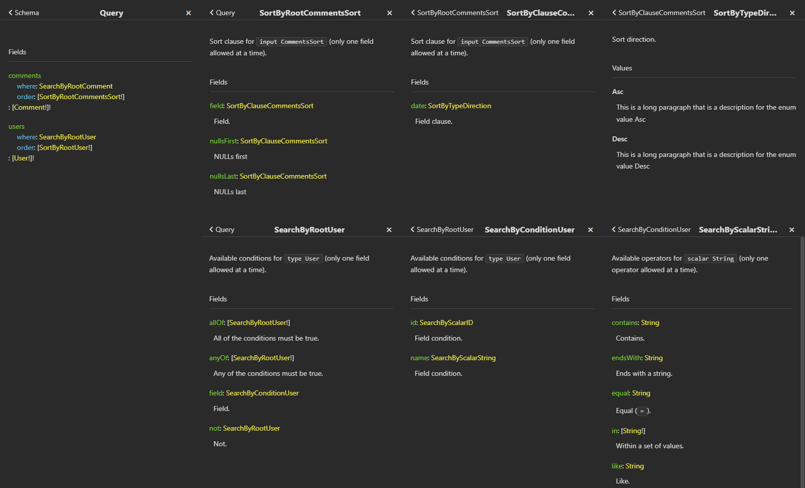

# Strictly typed Searching and Sorting

Built-in directives like `@where*`/`@orderBy` don't provide strict types for your schema. Also, these directives often require you to set columns as enum/list of strings by hand. Clients must know their types too, and usually should use `Mixed` to pass arguments -> they can pass unexpected values and get unpredictable results 😁 So the `Mixed` type is probably is not you want to see in a strictly typed GraphQL world. It all leads to increased complexity and support costs for your API.

A few years ago I opened [Better alternative for @whereConditions/@orderBy](https://github.com/nuwave/lighthouse/issues/1782) to discuss two new directives which solve it with the community. The [project](https://github.com/LastDragon-ru/php-packages/tree/main/packages/lara-asp-graphql) became too big too quickly, and so merging into Lighthouse is too complex now. It is also required a newer version of PHP/Laravel. On the other hand, you will get:

* Fully strictly typed `@searchBy` and `@sortBy`
* Full control over available fields and operators
* Eloquent/Query/Scout builder support
* Almost all relations support (Eloquent)
* Almost all searching operators out the box
* `All`, `any`, and even `not` conditions
* Custom operators support
* Custom builders support
* Order by random
* NULLs ordering
* No array of strings
* No `Mixed`

## Installation

```shell
composer require lastdragon-ru/lara-asp-graphql
```

## Usage

Usage is pretty simple. By default, all fields and types will be generated automatically. The following code will generate the schema where users and comments can be found by any field, users can be sorted by any field, but comments only by `date`. Please check the [documentation](https://github.com/LastDragon-ru/php-packages/tree/main/packages/lara-asp-graphql) for more examples/customization.

```graphql
scalar Date @scalar(class: "Nuwave\\Lighthouse\\Schema\\Types\\Scalars\\Date")

type Query {
    users(where: _ @searchBy, order: _ @sortBy): [User!]! @all
    comments(where: _ @searchBy, order: CommentsSort @sortBy): [Comment!]! @all
}

type User {
    id: ID!
    name: String!
}

type Comment {
    text: String!
    user: User @belongsTo
    date: Date
}

input CommentsSort {
    date: Date
}
```



Let's Query!

```graphql
query {
    # Users with `name` = 'User A'
    a: users(
        where: {
            field: {
                name: {equal: "User A"}
            }
        }
    ) {
        id
        name
    }
    
    # Users with `id` = 1 and `name` = 'User B'
    b: users(
        where: {
            allOf: [
                {
                    field: {
                        id: {equal: 1}
                    }
                }
                {
                    field: {
                        name: {equal: "User B"}
                    }
                }
            ]
        }
    ) {
        id
        name
    }
    
    # Comments from user with `name` = 'User A', ordered by `date`
    c: comments(
        where: {
            field: {
                user: {
                    where: {
                        field: {
                            name: {equal: "User A"}
                        }
                    }
                }
            }
        }
        order: {
            field: {date: Desc}
        }
    ) {
        date
        text
    }
}
```

## Notes

1) You may notice that inputs may look deep, especially when you use `AND`/`OR` operators. Why not just `{id: {equal: 1}, name: {equal: "User B"}}`? There are two main reasons for this

    * Ambiguity: `id AND name` or `id OR name`?  The `allOf`/`anyOf`/`field` solve it, because we always know what exactly we want.
    * Possible conflicts between operators (`allOf`, `anyOf`, `not`, etc) and field names. Resolving will significantly increase code complexity.

2) Probably it is a good idea to limit operators/fields available in the schema because some of them may be heavy. For example, not all databases support native NULLs ordering, additional clause will be added in this case.
