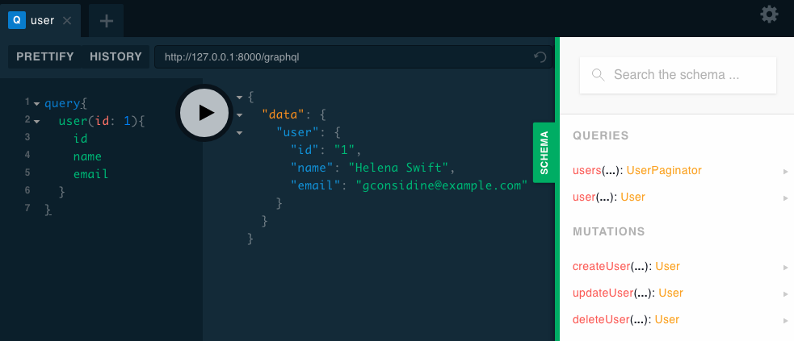
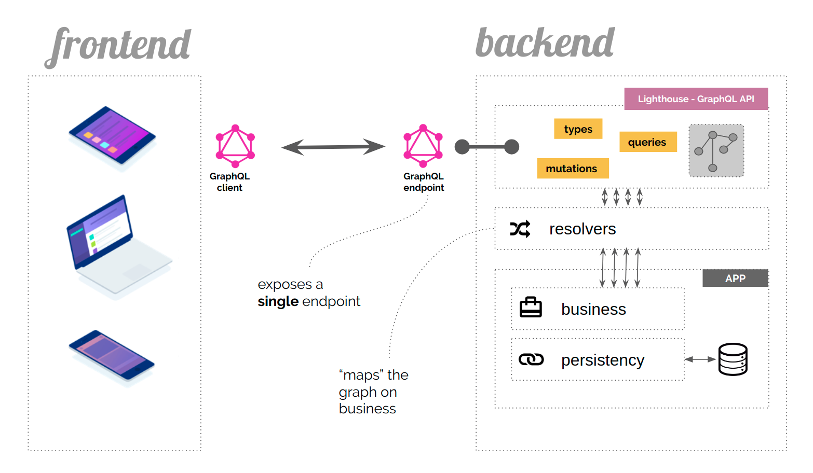
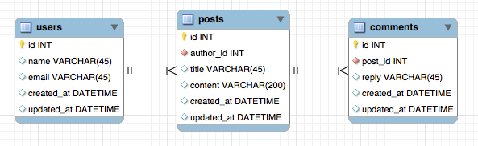

# Tutorial

This is an introductory tutorial for building a GraphQL server with Lighthouse.
While we try to keep it beginner friendly, we recommend familiarizing yourself
with [GraphQL](https://graphql.org/) and [Laravel](https://laravel.com/) first.

The source code of the finished project is available at [nuwave/lighthouse-tutorial](https://github.com/nuwave/lighthouse-tutorial).

## What is GraphQL?

GraphQL is a query language for APIs and a runtime for fulfilling those queries with your existing data.

GraphQL provides a complete and understandable description of the data in your API,
gives clients the power to ask for exactly what they need and nothing more,
makes it easier to evolve APIs over time, and enables powerful developer tools.

<div align="center">
    
  <small>GraphQL Playground</small>
</div>

GraphQL has been released only as a [_specification_](https://facebook.github.io/graphql/).
This means that GraphQL is in fact not more than a long document that describes in detail
the behaviour of a GraphQL server.

GraphQL has its own type system that’s used to define the schema of an API.
The syntax for writing schemas is called [Schema Definition Language](https://www.prisma.io/blog/graphql-sdl-schema-definition-language-6755bcb9ce51/) or short **SDL**.

Here is an example how we can use the SDL to define a type called `User` and its
relation to another type `Post`.

```graphql
type User {
  id: ID!
  name: String!
  posts: [Post!]!
}

type Post {
  title: String!
  author: User!
}
```

Note that we just created a one-to-many relationship between `User` and `Post`.
The type `User` has a field `posts` that returns a list of `Post` types.

We also defined the inverse relationship from `Post` to `User` through the `author` field.

## What is Lighthouse?

Lighthouse integrates with any Laravel project to make it easy to serve
your own GraphQL server.

The process of building a GraphQL server with Lighthouse can be described in 3 steps:

1. Define the shape of your data using the GraphQL Schema Definition Language
1. Use directives to bring your schema to life
1. Add custom functionality where you need it

<div align="center">
    
  <small>The role of GraphQL in your application</small>
</div>

## Agenda

In this tutorial we will create a GraphQL API for a simple Blog from scratch with:

- Laravel
- Lighthouse
- GraphQL Playground

::: tip
You can download the source code for this tutorial at [https://github.com/nuwave/lighthouse-tutorial](https://github.com/nuwave/lighthouse-tutorial)
:::

## Installation

### Create a new Laravel project

::: tip
This tutorial starts with a fresh Laravel project.
You can use an existing project and skip ahead to [Installing Lighthouse](#installing-lighthouse),
but you may have to adapt a few things to fit your existing app as we go along.
:::

Assuming you are using the Laravel installer, create a new project
(read more about [installing Laravel](https://laravel.com/docs/#installing-laravel)):

    laravel new lighthouse-tutorial

Consult the [Laravel docs on database configuration](https://laravel.com/docs/database#configuration)
and ensure you have a working database set up.

Run database migrations to create the `users` table:

    php artisan migrate

Seed the database with some fake users:

    php artisan tinker
    factory('App\User', 10)->create();

### Installing Lighthouse

Of course, we will use Lighthouse as the GraphQL Server.

    composer require nuwave/lighthouse

In this tutorial we will use [GraphQL Playground](https://github.com/prisma-labs/graphql-playground)
as an IDE for GraphQL queries. It's like Postman for GraphQL, but with super powers.

    composer require mll-lab/laravel-graphql-playground

Then publish default schema to `graphql/schema.graphql`.

    php artisan vendor:publish --tag=lighthouse-schema

To make sure everything is working, access Laravel GraphQL Playground on `/graphql-playground`
and try the following query:

```graphql
{
  user(id: 1) {
    id
    name
    email
  }
}
```

Now, let's move on and create a GraphQL API for our blog.

## The Models

This first part will show you how to set up the models and database migrations
and does not include any specifics related to GraphQL or Lighthouse.

Our blog follows some simples rules:

- a user can publish multiple posts
- each post can have multiple comments from anonymous users

We can model this in our database schema like this.

<div align="center">
    
  <p><small>Database relations diagram</small></p>
</div>

Begin by defining models and migrations for your posts and comments

    php artisan make:model -m Post

Replace the newly generated `app/Models/Post.php` and the `create_posts_table.php` with this:

```php
<?php

namespace App\Models;

use Illuminate\Database\Eloquent\Model;
use Illuminate\Database\Eloquent\Relations\HasMany;
use Illuminate\Database\Eloquent\Relations\BelongsTo;

class Post extends Model
{
    public function author(): BelongsTo
    {
        return $this->belongsTo(User::class);
    }

    public function comments(): HasMany
    {
        return $this->hasMany(Comment::class);
    }
}
```

```php
<?php

use Illuminate\Support\Facades\Schema;
use Illuminate\Database\Schema\Blueprint;
use Illuminate\Database\Migrations\Migration;

class CreatePostsTable extends Migration
{
    public function up(): void
    {
        Schema::create('posts', function (Blueprint $table) {
            $table->id('id');
            $table->unsignedBigInteger('author_id');
            $table->string('title');
            $table->string('content');
            $table->timestamps();
        });
    }

    public function down(): void
    {
        Schema::dropIfExists('posts');
    }
}
```

Let's do the same for the Comment model:

    php artisan make:model -m Comment

```php
<?php

namespace App\Models;

use Illuminate\Database\Eloquent\Model;
use Illuminate\Database\Eloquent\Relations\BelongsTo;

class Comment extends Model
{
    public function post(): BelongsTo
    {
        return $this->belongsTo(Post::class);
    }
}
```

```php
<?php

use Illuminate\Support\Facades\Schema;
use Illuminate\Database\Schema\Blueprint;
use Illuminate\Database\Migrations\Migration;

class CreateCommentsTable extends Migration
{
    public function up(): void
    {
        Schema::create('comments', function (Blueprint $table) {
            $table->id('id');
            $table->unsignedBigInteger('post_id');
            $table->string('reply');
            $table->timestamps();
        });
    }

    public function down(): void
    {
        Schema::dropIfExists('comments');
    }
}
```

Remember to run the migrations:

    php artisan migrate

Finally, add the `posts` relation to `app/Models/User.php`

```php
<?php

namespace App\Models;

use Illuminate\Database\Eloquent\Relations\HasMany;
use Illuminate\Foundation\Auth\User as Authenticatable;
use Illuminate\Notifications\Notifiable;

class User extends Authenticatable
{
    use Notifiable;

    /**
     * The attributes that are mass assignable.
     *
     * @var array
     */
    protected $fillable = [
        'name', 'email', 'password',
    ];

    /**
     * The attributes that should be hidden for arrays.
     *
     * @var array
     */
    protected $hidden = [
        'password', 'remember_token',
    ];

    /**
     * The attributes that should be cast to native types.
     *
     * @var array
     */
    protected $casts = [
        'email_verified_at' => 'datetime',
    ];

    public function posts(): HasMany
    {
        return $this->hasMany(Post::class, 'author_id');
    }
}
```

## The Schema

Let's edit `graphql/schema.graphql` and define our blog schema,
based on the Eloquent models we created.

We add two queries for retrieving posts to the root `Query` type:

```diff
type Query {
+  posts: [Post!]! @all
+  post(id: Int! @eq): Post @find
}
```

The way that Lighthouse knows how to resolve the queries is a combination of convention-based
naming - the type name `Post` is also the name of our Model - and the use of server-side directives.

- [@all](../master/api-reference/directives.md#all) returns a list of all `Post` models
- [@find](../master/api-reference/directives.md#find) and [@eq](../master/api-reference/directives.md#eq)
  are combined to retrieve a single `Post` by its ID

We add additional type definitions that clearly define the shape of our data:

```graphql
type User {
  id: ID!
  name: String!
  email: String!
  created_at: DateTime!
  updated_at: DateTime!
  posts: [Post!]! @hasMany
}

type Post {
  id: ID!
  title: String!
  content: String!
  author: User! @belongsTo
  comments: [Comment!]! @hasMany
}

type Comment {
  id: ID!
  reply: String!
  post: Post! @belongsTo
}
```

Just like in Eloquent, we express the relationship between our types using the
[@belongsTo](../master/api-reference/directives.md#belongsto) and [@hasMany](../master/api-reference/directives.md#hasmany) directives.

## The Result

Insert some fake data into your database,
you can use [Laravel seeders](https://laravel.com/docs/seeding) for that.

Visit `/graphql-playground` and try the following query:

```graphql
{
  posts {
    id
    title
    author {
      name
    }
    comments {
      id
      reply
    }
  }
}
```

You should get a list of all the posts in your database,
together with all of its comments and the name of the author.

Hopefully, this example showed you a glimpse of the power of GraphQL
and how Lighthouse makes it easy to build your own server with Laravel.

## Next Steps

The app you just built might use some more features.
Here are a few ideas on what you might add to learn more about Lighthouse.

- [Add pagination to your fields](../master/api-reference/directives.md#paginate)
- [Create and update eloquent models](../master/eloquent/getting-started.md#create)
- [Validate the inputs that are sent to your server](../master/security/validation.md)
